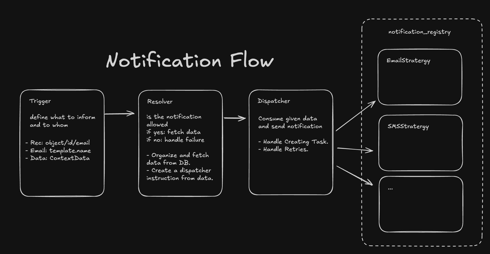
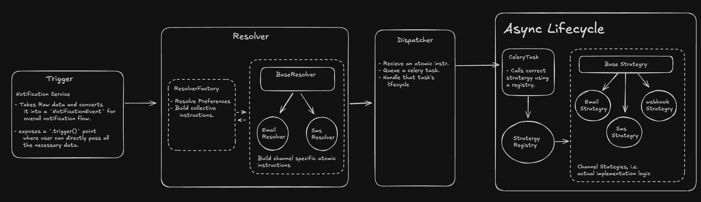

# Notification System - Design & Architecture

The BMA Notification System is built on an **event-driven, asynchronous architecture** designed for high reliability, multi-tenant isolation, and flexible delivery channel management.

## 1. Architectural Patterns

The system employs three core design patterns to maintain a clean separation of concerns:

- **Observer / Event-Driven:** Application triggers emit events without knowing how they will be delivered.
- **Strategy Pattern:** Delivery channels (Email, SMS, Push) are resolved at runtime based on configuration.
- **Command Pattern:** `ChannelInstructions` act as command objects, decoupling the resolution logic from the actual execution in Celery.

## 2. Core Components & Flow

The lifecycle of a notification follows a strictly defined path:

```
[ Trigger ] → [ Resolver ] → [ Dispatcher ] → [ Celery Worker ]
  (Sync)        (Sync)         (Sync)            (Async)
```



### 1. Trigger (Synchronous)

Any part of the application can trigger a notification by calling the `NotificationService`.

- **Contract:** Defined by `NotificationEvent` (dataclass).
- **Input:** Event type, Recipient, Context data, Priority.

### 2. Resolver (Synchronous)

The "brain" of the system. It performs database reads to determine _if_ and _how_ a notification should be sent.

- **Logic:** Intersects Tenant configuration with User preferences.
- **Output:** A list of `ChannelInstruction` objects.
- **Rule:** The Resolver never performs I/O outside of database reads and never triggers external APIs.

### 3. Dispatcher (Synchronous)

Converts instructions into persistent logs and schedules asynchronous work.

- **Action:** Creates a `NotificationLog` entry in the `QUEUED` state.
- **Action:** Fires the `send_notification_task` Celery task.

### 4. Celery Task (Asynchronous)

The execution layer that interacts with the outside world.

- **Queue:** Routed to the `fast` queue.
- **Action:** Renders the template using the stored context.
- **Action:** Calls the specific channel provider (e.g., SendGrid, Twilio).
- **Action:** Updates `NotificationLog` with success/failure status.

## 3. Configuration Logic: Ceiling & Floor

We use a "Ceiling and Floor" model to manage preferences in a multi-tenant environment:

- **Tenant Config (The Ceiling):** Defines which channels are permitted for specific events across the entire organization.
- **User Preference (The Floor):** Allows users to opt-out of specific channels permitted by the tenant.

**Computation:** The final delivery set is a **set intersection** of the Tenant's allowed channels and the User's opted-in channels.

> _Note: A user can only opt-down, never up beyond what the tenant permits._

## 4. Template Resolution & Fallbacks

Templates are resolved during the **Resolution** phase and rendered during the **Execution** phase.

### Resolution Strategy

We follow **Option 1: Seeded Defaults**.

1. **Tenant Provisioning:** When a tenant is created, default templates are seeded into their schema.
2. **Runtime:** The Resolver queries the tenant's schema directly.
3. **Isolation:** This ensures tenants are protected from global template changes and allows for full customization per tenant.

### Fallback Logic (Conceptual)

If a tenant-specific template is missing, the system can fallback to a global registry:

```python
def resolve_template(event_type, channel, schema_name):
    tenant_template = query_tenant_schema(event_type, channel)
    if tenant_template:
        return tenant_template
    return GlobalTemplateRegistry.get_default(event_type, channel)
```



## 5. Data Models

### Global Schema (Public)

Used for system-wide defaults and infrastructure.

#### `GlobalTemplateRegistry`

- `template_name`: Unique identifier (e.g., `invoice_generated`).
- `content`: JSON containing default subject, text, and HTML.
- `is_active`: Boolean.

### Tenant Schema

Isolated data for each organization.

#### `NotificationTemplate`

- `event_type`: Ties template to a specific trigger (e.g., `INVOICE_GENERATED`).
- `channel`: `EMAIL`, `SMS`.
- `subject`: Template for the subject line.
- `plain_text`: Main content template.
- `html`: Optional HTML version.
- `language`: ISO code.

#### `NotificationLog`

Tracks the history and status of all sent notifications.

- `status`: `QUEUED`, `SENT`, `FAILED`, `BOUNCED`.
- `task_id`: Celery task ID for traceability.
- `channel`: `EMAIL` or `SMS`.
- `template_snapshot`: The final rendered content (stored for audit).
- `context_data`: JSON of variables used at rendering.
- `errors`: Traceback or error message if failed.

#### `NotificationPreference`

- `user`: FK to User.
- `event_type`: Per-event granularity.
- `opted_email`: Boolean.
- `opted_sms`: Boolean.

## 6. Infrastructure & Reliability

### Async Boundary

All actual sending happens in the `fast` queue using the `bma.notification.*` namespace.

### Failure Handling

Notifications use the **ALERT** or **DLQ** failure tiers defined in the [Asynchronous Architecture](../../documentation/Asynchronus_Architecture.md):

- **ALERT:** Simple log + admin notification for non-critical alerts.
- **DLQ (Dead Letter Queue):** Used for critical business notifications (e.g., Invoice Sent) to allow for manual replay upon failure.
