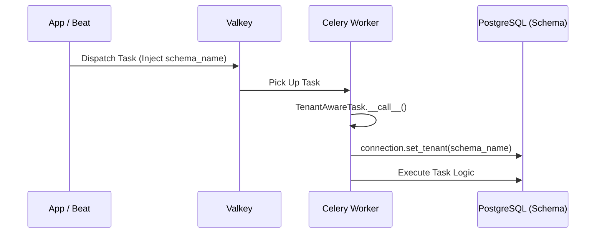

# Asynchronous Task System

TL;DR: BMA's asynchronous system uses Celery with Valkey to handle background tasks and periodic jobs. It features a tenant-aware task base class, explicit task naming, and a three-tier failure classification system (SILENT, ALERT, DLQ).

This document covers the infrastructure, task structure, multi-tenancy integration, and failure handling of the asynchronous engine.

## Infrastructure

### Message Broker: Valkey
We use two separate Valkey instances to avoid resource contention:
- `valkey-cache`: For Django caching (volatile).
- `valkey-broker`: For Celery task brokering (persistent via `appendonly yes`).

### Result Backend: PostgreSQL
Task results are stored in PostgreSQL via `django-celery-results`. This provides persistent, queryable audit trails for task outcomes, which is critical for business operations like invoice generation.

### Beat Scheduler: Database-backed
We use `django-celery-beat` with the `DatabaseScheduler`. This allows managing periodic jobs (adding, modifying, disabling) at runtime via the Django Admin without requiring redeployments.

## Multi-Tenancy Integration

### `TenantAwareTask`
Since Celery workers run outside the HTTP request/response cycle, they lack an active tenant context. BMA uses a custom `TenantAwareTask` base class to inject and activate the correct schema at runtime.

## Failure Classification System
Not all failures are equal. We classify failures into three tiers at task declaration:

| Tier     | Behaviour                                                   | Use Case                                           |
| -------- | ----------------------------------------------------------- | -------------------------------------------------- |
| `SILENT` | Log + mark result. No notification.                         | Non-critical cleanup jobs.                         |
| `ALERT`  | Log + notify admin (Sentry/email).                          | Failures requiring human intervention (e.g., PDF). |
| `DLQ`    | Move to Dead Letter Queue + Alert. Manual replay supported. | Critical business events (e.g., Emails/SMS).       |

### Dead Letter Queue (DLQ)
The DLQ lives in the `public` schema and stores failed tasks that require manual review and replay. This ensures that no critical business event is permanently lost due to transient failures or configuration issues.

## Periodic Tasks & Fan-Out
Periodic tasks follow a **Coordinator Pattern** to handle multi-tenancy.

1. **Beat** fires a coordinator task (in `public` schema).
2. **Coordinator** discovers active tenants.
3. **Coordinator** fans out per-tenant subtasks with explicit schema names.

---

## Related Documents
- [Architectural Overview](./overview.md)
- [Multi-Tenancy](./multi-tenancy.md)
- [Notification Design](../patterns/notifications.md)
