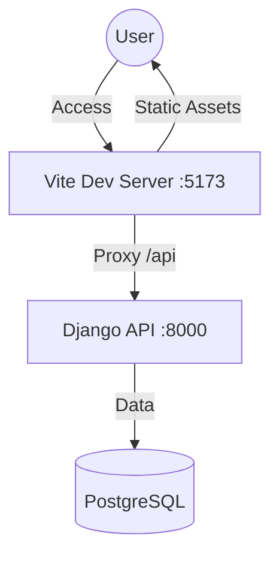
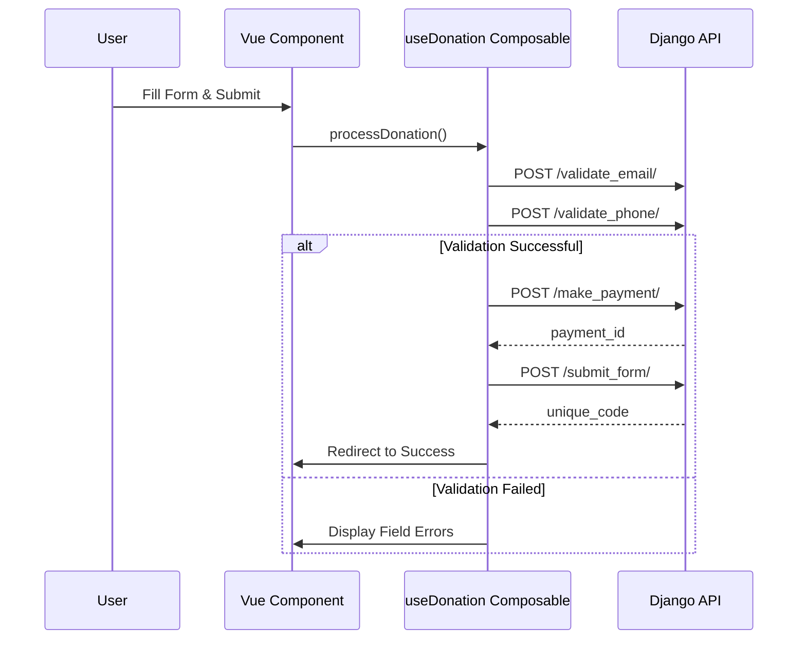

# Frontend Architecture

TL;DR: The frontend is a Vue 3 SPA built with Vite and Vuetify 3. It follows a decoupled architecture, communicating with the backend via a service layer and managing state with Pinia.

This document covers the technology stack, high-level architecture, state management, and key workflows of the BMA frontend.

## Tech Stack
- **Framework**: Vue 3 (Composition API)
- **Build Tool**: Vite
- **UI Component Library**: Vuetify 3
- **State Management**: Pinia
- **Routing**: Vue Router
- **HTTP Client**: Axios

## High-Level Architecture

The frontend is a standalone SPA residing in `frontend/`. In development, Vite proxies `/api` requests to the Django backend.

## State Management (Pinia)

We use specialized stores to manage reactive state:
- **Auth Store**: Session management, user roles, and tokens.
- **Config Store**: Global UI configurations (logos, branding) fetched from the tenant's backend.
- **Business Stores**: Feature-specific stores (e.g., `DonationStore`) to manage complex workflows.

## Key Workflows

### Donation/Payment Workflow
Complex multi-step processes are managed via **Composables** (e.g., `useDonation`), which orchestrate several API calls into a single reliable sequence.

## Theme & Styling
- **CSS Variables**: Global properties defined in `src/assets/variables.css` for light/dark mode.
- **Vuetify**: Configured to consume CSS variables for consistent component styling.
- **Priority**: Vuetify classes → props → SCSS variables → scoped CSS.

---

## Related Documents
- [Architectural Overview](./overview.md)
- [Payment Service Architecture](../patterns/payments.md)
