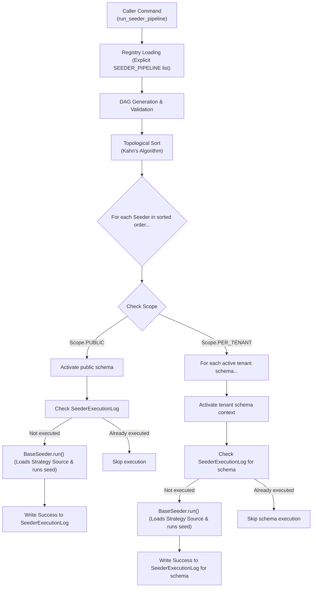

# Seeder 2.0 Design Specification

> Complete architectural blueprint for the next-generation idempotent, dependency-aware, multi-tenant seeding system.

---

## 1. Executive Summary & Vision

The Seeder 2.0 system transitions BMA's environment initialization from a static, manually-ordered pipeline to a **declarative, self-documenting Directed Acyclic Graph (DAG)**. It introduces formal Computer Science design patterns to guarantee **idempotency, schema safety, source extensibility, and automated dependency resolution** across all execution contexts.

### Key Goals
* **Automated Dependency Resolution**: Concrete seeders declare their preconditions, letting the orchestrator resolve run order.
* **Extensible Data Sources**: Decouple data retrieval (JSON files, factories, memory fakes) from database write logic.
* **Granular Scope Enforcement**: First-class tracking of schema scopes (`public` vs. `per_tenant`).
* **Robust Idempotency**: Persistent database execution logging to skip successfully run seeders.

---

## 2. Architecture Comparison (1.0 vs 2.0)

| Core Dimension | Seeder 1.0 (Current) | Seeder 2.0 (Proposed) |
| :--- | :--- | :--- |
| **Execution Ordering** | Static ordered list (`SEEDER_PIPELINE`), prone to FK constraint violations on edits. | Directed Acyclic Graph (DAG) resolved via **Topological Sort (Kahn's Algorithm)**. |
| **Data Extraction** | Hardcoded file loading inside seeder class or base methods. | **Strategy Pattern** behind a generic `DataSource` interface (JSON, factories, fakes). |
| **Execution State** | No state tracking. Re-running relies entirely on manual `get_or_create` logic. | **Execution Log Table** (`SeederExecutionLog`) for skip/run idempotency checks. |
| **Cross-Cutting Concerns** | Boilerplate try/except blocks and logs duplicated across subclass methods. | **Template Method Pattern** (`BaseSeeder.run` controls skeleton; subclasses implement `seed`). |
| **Multi-Tenancy** | Handled implicitly, requiring manual schema context switches and custom iterators. | First-class `Scope` configuration (`PUBLIC` vs. `PER_TENANT`) processed by the runner. |

---

## 3. High-Level Architecture (DAG Pipeline)

The following diagram visualizes the flow of Seeder 2.0, from registry parsing and topological sorting to context-scoped execution.



---

## 4. Concrete Design Patterns

### 4.1 Strategy Pattern (Data Acquisition)
**Problem**: The seeder class should not be coupled to the storage format or mechanism of the data it seeds. Swapping from JSON files to factory generators should require zero modification to the seeder's database write logic.

**Solution**: Define a generic `DataSource` interface. The seeder interacts only with the interface, while the configuration of the source is declared as a pluggable strategy.

```python
import json
import typing

class DataSource(typing.Protocol):
    def load(self) -> list[dict]:
        """Load and return structured data for seeding."""
        ...

class FixtureSource:
    """Strategy to load data from standard JSON files."""
    def __init__(self, filepath: str):
        self.filepath = filepath

    def load(self) -> list[dict]:
        with open(self.filepath, "r", encoding="utf-8") as f:
            return json.load(f)

class FactorySource:
    """Strategy to generate dynamic mock data using Factory Boy."""
    def __init__(self, factory_class: typing.Any, batch_size: int):
        self.factory_class = factory_class
        self.batch_size = batch_size

    def load(self) -> list[dict]:
        # Generates dictionary representations without writing directly to DB
        return self.factory_class.build_batch(self.batch_size)
```

Concrete seeder classes simply define their data acquisition strategy:
```python
class TenantSeeder(BaseSeeder):
    model = OrganizationTenant
    scope = Scope.PUBLIC
    data_source = FixtureSource("setup/local_setup/data/tenant_public.json")
```

---

### 4.2 Template Method Pattern (Execution Control)
**Problem**: Standard behaviors like schema activation, logging, transaction management, and execution logging are invariant. Duplicating this boilerplate across seeders leads to code bloat and silent error-swallowing.

**Solution**: Define the execution skeleton inside `BaseSeeder.run()` as a final (non-overridden) method, and delegate the variant operation (`seed()`) to the subclasses.

```python
import logging
from django.db import transaction

LOGGER = logging.getLogger(__name__)

class BaseSeeder:
    model: type
    scope: str
    data_source: DataSource
    depends_on: list[type["BaseSeeder"]] = []

    def run(self, schema_name: str) -> None:
        """The Template Method defining the execution lifecycle skeleton."""
        LOGGER.info("[%s] Seeder started running on schema: %s", self.__class__.__name__, schema_name)
        
        # Verify idempotency log before running
        if self._already_executed(schema_name):
            LOGGER.info("[%s] Already successfully executed on schema: %s. Skipping.", self.__class__.__name__, schema_name)
            return

        try:
            data = self.data_source.load()
            
            with transaction.atomic():
                self.seed(data, schema_name)
                
            self._log_execution_status(schema_name, "SUCCESS")
            LOGGER.info("[%s] Seeder completed successfully on schema: %s", self.__class__.__name__, schema_name)
            
        except Exception as e:
            self._log_execution_status(schema_name, "FAILED")
            LOGGER.error("[%s] Seeder failed on schema %s: %s", self.__class__.__name__, schema_name, str(e))
            raise e

    def seed(self, data: list[dict], schema_name: str) -> None:
        """The Primitive Operation to be overridden by subclasses."""
        raise NotImplementedError("Subclasses must implement seed()")
```

---

### 4.3 Topological Sort (Dependency DAG)
**Problem**: Seeding ordering must respect foreign key constraints (e.g. `UserSeeder` requires `TenantSeeder` to have run; `CustomerAddressSeeder` requires `CustomerSeeder`). Maintaining a manual pipeline list is fragile and does not scale.

**Solution**: Build a directed dependency graph at runner start and execute **Kahn's Algorithm** to compute the execution order. If a circular dependency exists, fail loudly during compilation.

```python
from collections import defaultdict, deque

def topological_sort(seeders: list[type[BaseSeeder]]) -> list[type[BaseSeeder]]:
    # Step 1: Map out adjacencies and in-degree counts
    adj = defaultdict(list)
    in_degree = {s: 0 for s in seeders}

    for seeder in seeders:
        for dependency in seeder.depends_on:
            if dependency in in_degree:
                adj[dependency].append(seeder)
                in_degree[seeder] += 1

    # Step 2: Queue nodes with 0 in-degree dependencies
    queue = deque([s for s, degree in in_degree.items() if degree == 0])
    order = []

    while queue:
        node = queue.popleft()
        order.append(node)
        for neighbor in adj[node]:
            in_degree[neighbor] -= 1
            if in_degree[neighbor] == 0:
                queue.append(neighbor)

    # Step 3: Check for circular dependency cycle
    if len(order) != len(seeders):
        cyclic_nodes = [s.__name__ for s, degree in in_degree.items() if degree > 0]
        raise ValueError(f"Circular dependency detected in seeder pipeline: {', '.join(cyclic_nodes)}")

    return order
```

---

### 4.4 Scope Definition
**Problem**: Some seeders operate platform-wide (e.g., creating the tenants themselves), while others populate tables local to each tenant's schema context. 

**Solution**: Declare scope as a first-class property inside the base class.

```python
class Scope:
    PUBLIC = "public"          # Executed exactly once inside the public schema
    PER_TENANT = "per_tenant"  # Executed inside each individual tenant's schema context
```

The Orchestrator reads this scope and expands the run pipeline:
```python
from django_tenants.utils import schema_context

def run_seeder_pipeline():
    sorted_seeders = topological_sort(SEEDER_PIPELINE)
    
    for seeder_cls in sorted_seeders:
        seeder = seeder_cls()
        
        if seeder.scope == Scope.PUBLIC:
            with schema_context("public"):
                seeder.run("public")
        elif seeder.scope == Scope.PER_TENANT:
            # Fetch active tenant schemas from public database
            tenants = OrganizationTenant.objects.filter(in_production=False)
            for tenant in tenants:
                with schema_context(tenant.schema_name):
                    seeder.run(tenant.schema_name)
```

---

## 5. Execution State & Idempotency Logs

To guarantee idempotency, execution logs are tracked in a dedicated audit database table. A seeder runs on a schema context only if no `SUCCESS` entry exists for it.

### Database Schema
```python
from django.db import models

class SeederExecutionLog(models.Model):
    seeder_name = models.CharField(max_length=255)
    schema_name = models.CharField(max_length=255)
    status = models.CharField(max_length=50)  # SUCCESS, FAILED
    executed_at = models.DateTimeField(auto_now=True)

    class Meta:
        db_table = "seeder_execution_log"
        unique_together = ("seeder_name", "schema_name")
```

*Note: In case a database reset is needed, dropping the database or clearing the `SeederExecutionLog` table allows the pipeline to run fresh.*

---

## 6. Directory Layout (Single Tenant Template)

Tenant environments are structurally identical. Instead of duplicating separate data files for each tenant, Seeder 2.0 structures fixtures using a **Single Tenant Template**.

```text
backend/apps/setup/local_setup/data/
├── dev/
│   ├── public/
│   │   ├── OrganizationTenant.json     # Declarative list of dev tenants (schemas)
│   │   └── Users.json                  # Platform-wide administrator users
│   └── tenant/                         # Template directory used for ALL tenants
│       ├── Users.json                  # Tenant-specific users
│       ├── Configurations/
│       │   ├── ui_config.json          # Default UI configuration template
│       │   └── notification_config.json# Default notification setup template
│       └── NotificationTemplate.json   # Template variables
└── prod/
    └── public/
        └── Configurations/
            └── production_ui.json
```

1. **`OrganizationTenant.json`**: Acts as the single source of truth for dev tenants. The orchestrator reads this, provisions the database schemas, and loops through the `tenant/` template directory to initialize each tenant's database records.
2. **`tenant/` template**: Loaded and inserted in the active schema context during the loop execution.

---

## 7. Explicit Pipeline Registration

To prevent OS-specific file order bugs and Python import side-effects (common in folder-scanning auto-discovery approaches), Seeder 2.0 registers seeders using an explicit list:

```python
# backend/apps/setup/local_setup/seeders/registry.py

SEEDER_PIPELINE = [
    TenantSeeder,
    UserSeeder,
    CustomerSeeder,
    NotificationSeeder,
    InvoiceSeeder,
]
```

### Safety Advantages
* **Deterministic Behavior**: The graph compilation starts from a known list of classes.
* **Fail-Loud Design**: If a developer forgets to register their seeder in `SEEDER_PIPELINE`, it won't run, presenting a clear error instead of failing silently.
