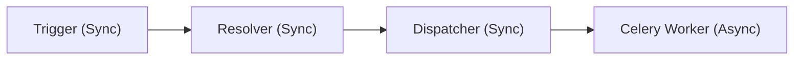

# Notification Design

TL;DR: The notification system uses an event-driven, asynchronous architecture to deliver messages across multiple channels (Email, SMS). It employs a "Ceiling and Floor" model to balance tenant-level permissions with user-level preferences.

This document covers the architectural patterns, core components, and configuration logic of the BMA notification system.

## Architectural Patterns

The system employs three core design patterns to maintain a clean separation of concerns:
- **Observer / Event-Driven:** Application triggers emit events without knowing how they will be delivered.
- **Strategy Pattern:** Delivery channels (Email, SMS, Push) are resolved at runtime based on configuration.
- **Command Pattern:** `ChannelInstructions` act as command objects, decoupling resolution from execution.

## Core Components & Flow

The lifecycle of a notification follows a strictly defined path:

### 1. Trigger (Synchronous)
Application logic triggers a notification by calling `NotificationService` with a `NotificationEvent` (dataclass).

### 2. Resolver (Synchronous)
The "brain" of the system. It intersects Tenant configuration with User preferences to determine the final delivery channels. It only performs database reads.

### 3. Dispatcher (Synchronous)
Creates a `NotificationLog` entry in the `QUEUED` state and dispatches the Celery task.

### 4. Celery Task (Asynchronous)
The execution layer that renders templates and calls external providers (e.g., SendGrid, Twilio).

## Preference Model: Ceiling & Floor

- **Tenant Config (The Ceiling):** Defines which channels are permitted for specific events across the entire organization.
- **User Preference (The Floor):** Allows users to opt-out of specific channels permitted by the tenant.

**Computation:** The final delivery set is the **intersection** of the Tenant's allowed channels and the User's opted-in channels.

## Data Models

### `NotificationTemplate` (Tenant Schema)
Ties an `event_type` and `channel` to specific subject and body templates.

### `NotificationLog` (Tenant Schema)
Tracks history, status (`QUEUED`, `SENT`, `FAILED`, `BOUNCED`), and stores rendered snapshots for auditing.

### `NotificationPreference` (Tenant Schema)
Stores per-user, per-event channel preferences.

---

## Related Documents
- [Asynchronous Task System](../architecture/async-system.md)
- [Multi-Tenancy Architecture](../architecture/multi-tenancy.md)
