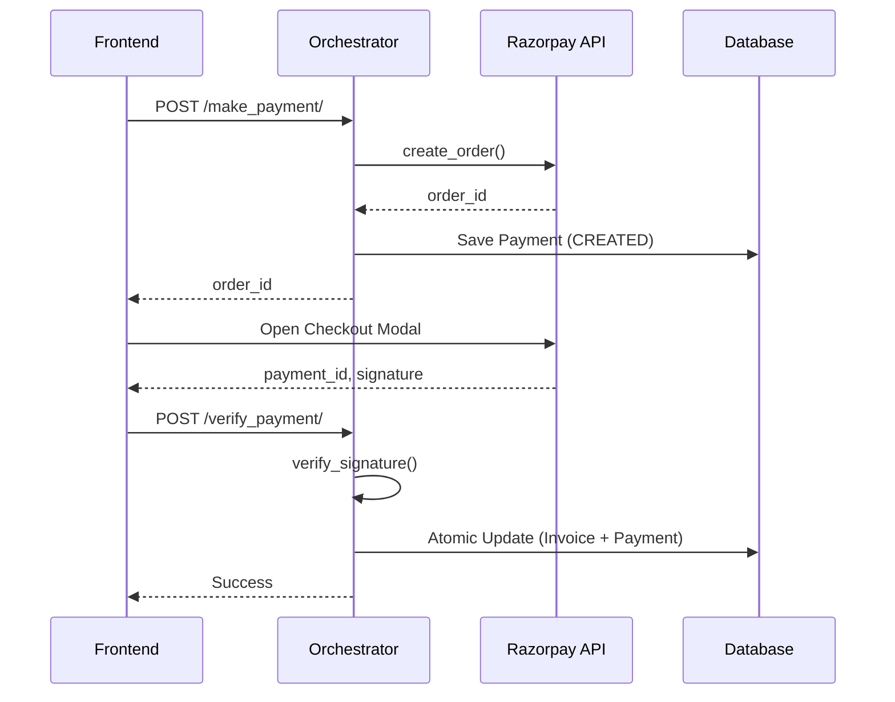

# Payment Service Architecture

TL;DR: The payment system is built on a layered architecture consisting of a base HTTP layer, a Razorpay-specific service layer, and a business-logic orchestrator. This ensures atomic updates and secure signature verification for all transactions.

This document covers the layered architecture and secure payment flow implemented in the BMA platform.

## Layered Architecture

### 1. Base HTTP Layer (`base.py`)
A generalized wrapper around the `requests` library using `Session` for connection pooling. It centralizes authentication, timeouts, and error logging.

### 2. Service Layer (`razorpay_service.py`)
Encapsulates Razorpay-specific API logic:
- `create_order`: Translates app data to Razorpay format.
- `fetch_payment`: Retrieves status from gateway.
- `verify_payment_signature`: Securely validates HMAC signatures.

### 3. Orchestration Layer (`payment_orchestrator.py`)
Coordinates between external services and the internal database:
- `create_razorpay_order`: Records initial `Payment` and creates gateway order.
- `verify_razorpay_payment`: Validates signatures and atomically updates `Payment` and `Invoice` statuses.

## Successful Payment Flow

## Security Implementation
- **Atomic Updates**: Uses `@transaction.atomic` to ensure `Payment` and `Invoice` records stay in sync.
- **Race Condition Protection**: Uses `select_for_update()` on the payment record during verification.
- **Signature Verification**: Signatures are computed locally using HMAC-SHA256 with the secret key.

---

## Related Documents
- [Razorpay Integration Spec](../integrations/razorpay.md)
- [Frontend Architecture](../architecture/frontend.md)
- [Data Modeling](../architecture/data-models.md)
