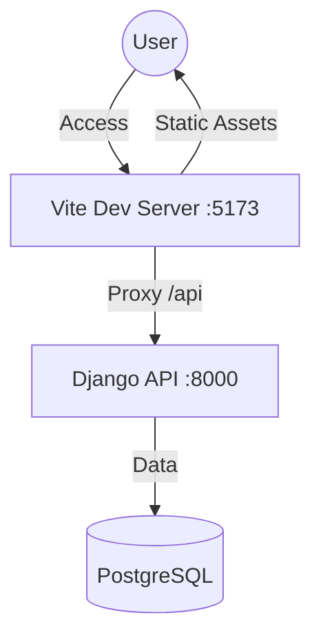
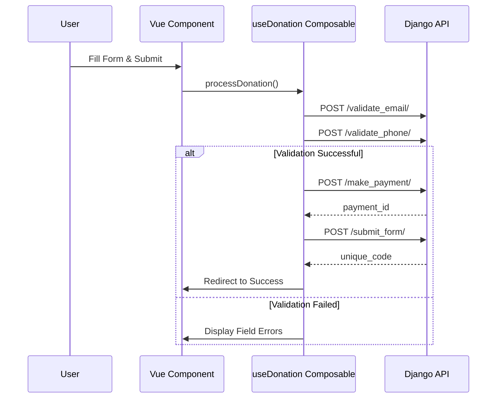

# Frontend Architecture: Vue 3 + Vite SPA

This document outlines the architecture and implementation details of the decoupled frontend for the Bill Management System.

## Tech Stack
- **Framework**: Vue 3 (Composition API)
- **Build Tool**: Vite
- **UI Component Library**: Vuetify 3
- **State Management**: Pinia
- **Routing**: Vue Router
- **HTTP Client**: Axios
- **Styling**: CSS Variables (Variables.css) + SCSS

## High-Level Architecture

The frontend is a standalone Single Page Application (SPA) that resides in the `frontend/` directory. It communicates with the Django REST API through a proxy configured in Vite, avoiding CORS issues during development.

## State Management (Pinia)

The application uses three primary stores:
1.  **Auth Store**: Manages user session, roles (e.g., `client_admin`), and tokens.
2.  **Config Store**: Holds global configurations like App Name, Logo URL, and feature flags.
3.  **Donation Store**: Manages the multi-step state of the donation workflow.

## Key Workflows

### Donation Workflow
The donation process is managed by the `useDonation` composable, ensuring a reliable and retryable sequence.

## Integration & Deployment
- **Docker**: The frontend is containerized using a multi-stage Dockerfile (`compose/local/vue/Dockerfile`).
- **Proxy**: In development, Vite proxies `/api` to the `django` service defined in Docker Compose.
- **Environment Variables**:
    - `VITE_API_BASE_URL`: Base endpoint for API calls.
    - `VITE_APP_NAME`: Configurable branding.
    - `VITE_BUILD_TAG`: Displayed in the footer for version tracking.

## Theme & Styling
Styles are managed via `src/assets/variables.css`, which defines CSS custom properties for light and dark modes. Vuetify is configured to consume these variables, ensuring a unified look across all components.
